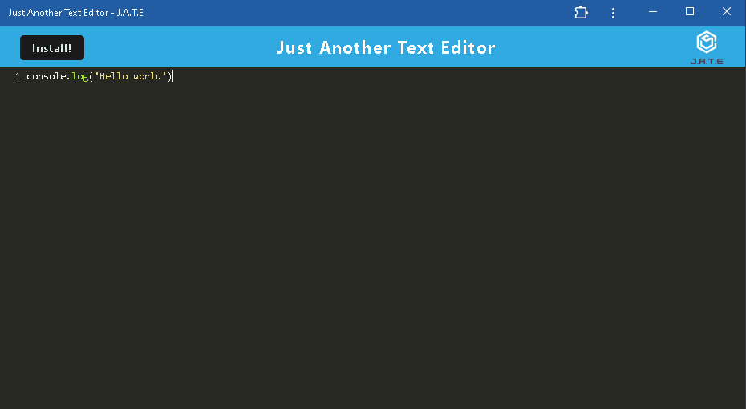
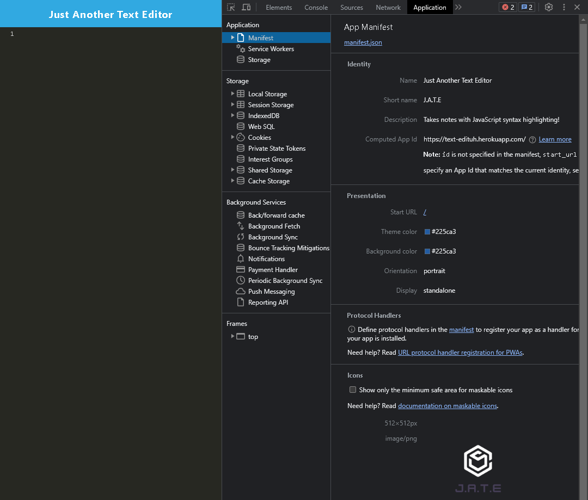
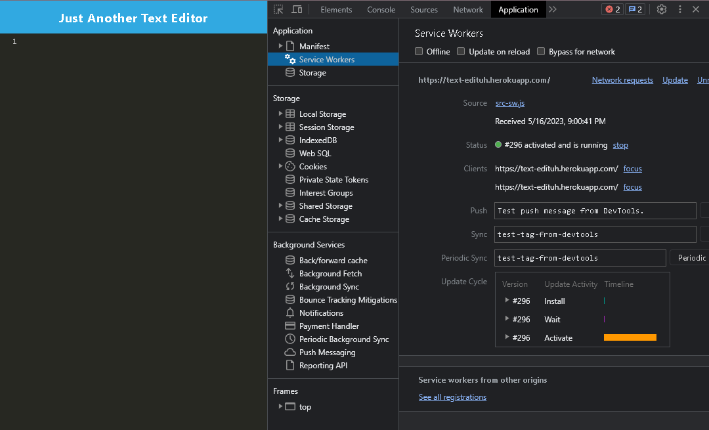
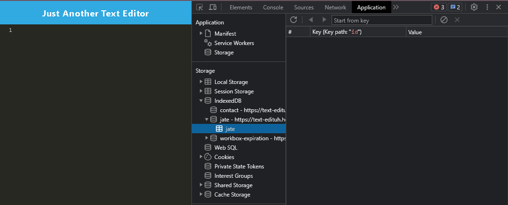

# Text-Editor

## Description

The motivation behind this project is to build a single-page text editor that runs in the browser and also functions offline. This project is a great example and practice for storing and retrieving data from database. 

## Table of Contents

- [Installation](#installation)
- [Usage](#usage)
- [Credits](#credits)
- [License](#license)
- [Link](#link)
- [Screenshot](#screenshot)
## Installation

<li> Create a repository on Github and clone the files to a local location on your device
<li> First, open Terminal and run command "npm i" and followed by "npm run build"
<li> Once all packages and codes are built successfully, run command "npm run start" to start the application. 
<li> Then, application will be available for testing and viewing at localhost:3000

## Usage 

User can click on Install button in the left corner of homepage to install the application to their local device

 

After the application is installed successfully, user can use the application offline 

## Screenshot

Manifest.json file

 

Registered Service Worker

 

IndexDB Storage

## Link 

https://text-edituh.herokuapp.com/

## Credits 

Nathan
 
TAs- Justin & Brooke

## License

N/A